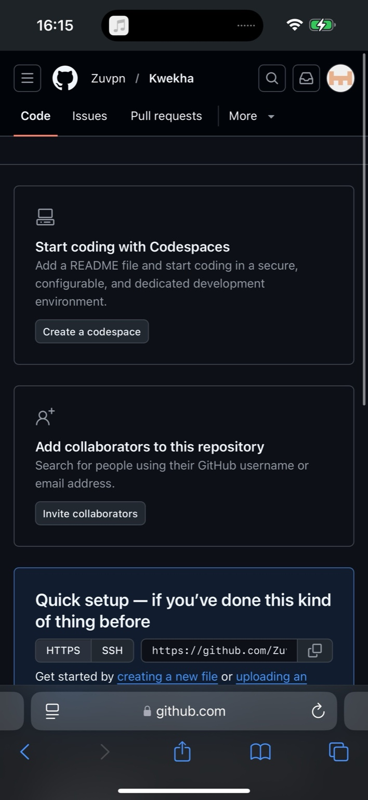

<p align="center">
  
</p>

<p align="center">
  <a href="https://github.com/Zuvpn/Kwekha/releases"></a>
  <a href="https://github.com/Zuvpn/Kwekha/blob/main/LICENSE"></a>
  <a href="https://github.com/Zuvpn/Kwekha/stargazers"></a>
  <a href="https://github.com/Zuvpn/Kwekha/issues"></a>
</p>

# Kwekha | کویخا
**Repo:** https://github.com/Zuvpn/Kwekha

Kwekha یک اسکریپت خیلی ساده برای مدیریت تونل‌های **gost** با **Wizard سریع** و سرویس‌های **systemd** است.

---

## One‑line installer (Linux)

```bash
bash <(curl -fsSL https://raw.githubusercontent.com/Zuvpn/Kwekha/main/kwekha.sh)
```

سپس در منو گزینه **3) Quick Setup Wizard (FAST)** را انتخاب کنید.

---

## فارسی (FA)

### نصب
روی هر دو سرور:

```bash
chmod +x kwekha.sh
sudo ./kwekha.sh
```

یا نصب یک‌خطی (بالا).

### راه‌اندازی قدم‌به‌قدم (Wizard)
**نکته مهم:** در نسخه جدید **UUID / یوزر / پسورد حذف شده‌اند** و `tunnel.id` از **اسم سرویس** ساخته می‌شود.  
پس روی هر دو سرور، **اسم سرویس باید دقیقاً یکسان باشد**.

#### 1) روی سرور خارج (Server)
1. منو → گزینه `3`
2. Role: `1`
3. Service name: مثلا `main-tunnel`
4. Protocol: فقط عدد (پیشنهادی `relay+wss`)
5. Tunnel port: مثلا `8443` (یا `443`)
6. Ports: فقط پورت‌ها مثل `80,443,2053`

#### 2) روی سرور ایران (Client)
1. منو → گزینه `3`
2. Role: `2`
3. Service name: **همان** `main-tunnel`
4. Protocol: همان مورد خارج
5. Tunnel port: همان مورد خارج
6. Ports: همان لیست
7. Abroad IP/Domain: مثلا `1.2.3.4`

### قابلیت‌ها
- Wizard فوق سریع (فقط چند ورودی)
- نصب/آپدیت gost با installer رسمی
- ساخت سرویس‌های systemd + لاگ جدا
- چند سرویس هم‌زمان
- Health Check (systemd + listen ports)
- تلگرام: وضعیت + آخرین خطوط لاگ
- کرون: ارسال هر ۱ ساعت
- Export/Import کانفیگ
- Self-update خود اسکریپت
- Uninstall کامل Kwekha (+ اختیاری حذف gost)

### تلگرام
1) منو → `6) Telegram setup`  
2) منو → `7) Enable cron`

---

## English (EN)

### Install
On both servers:

```bash
chmod +x kwekha.sh
sudo ./kwekha.sh
```

Or use the one-liner installer above.

### Wizard setup
**Note:** UUID/username/password are removed. `tunnel.id` is derived from the **service name**.  
So both sides must use the **same service name**.

#### Abroad server (Server)
- Menu → `3`
- Role: `1`
- Service name: e.g. `main-tunnel`
- Protocol: choose by number (recommended `relay+wss`)
- Tunnel port: e.g. `8443` (or `443`)
- Ports: numbers only, e.g. `80,443,2053`

#### Iran server (Client)
- Menu → `3`
- Role: `2`
- Same service name / protocol / tunnel port / ports list
- Set Abroad IP/Domain (e.g. `1.2.3.4`)

---

## Screenshot
<p align="center">
  
</p>

---

## License
MIT — see `LICENSE`.


> Wizard نکته: پروتکل‌های پیشنهادی با علامت ★ مشخص شده‌اند و بعد از وارد کردن اطلاعات، یک جدول Summary چاپ می‌شود تا عیناً روی سرور مقابل هم وارد کنید.


> Note: Protocol menu is printed to the terminal (TTY) so it always shows correctly even when the script captures the selected value internally.

## Forward مقصد (Localhost یا سرور مقابل)

در Wizard یک مرحله جدید اضافه شده:

- **روی همین سرور (127.0.0.1)**: وقتی سرویس مقصد (xray/nginx/panel) روی همان سرور اجراست.
- **روی سرور مقابل (IP/Domain)**: وقتی مثلا **پنل/Xray روی سرور خارج** است و می‌خواهید ورودی‌ها از ایران به خارج فوروارد شوند.

این گزینه جلوی خطاهای رایج مثل **Loop** و **Host Unreachable** را می‌گیرد.
